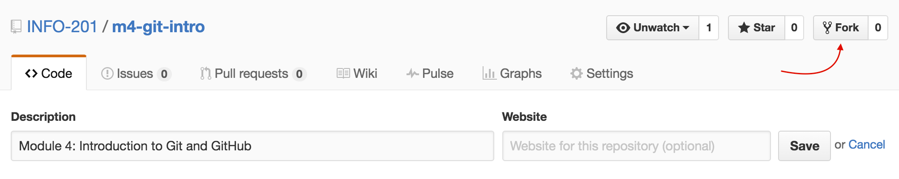
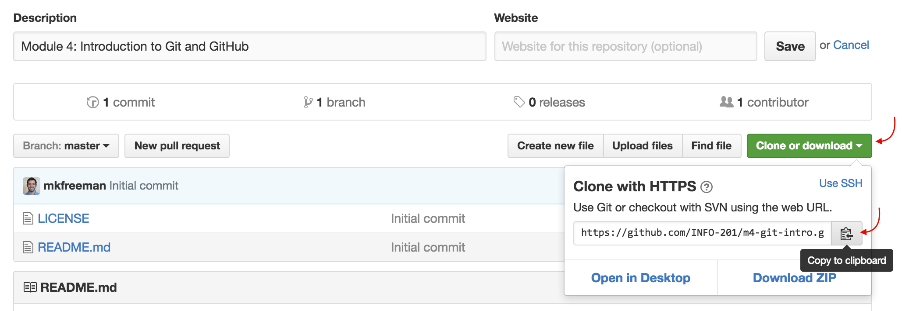
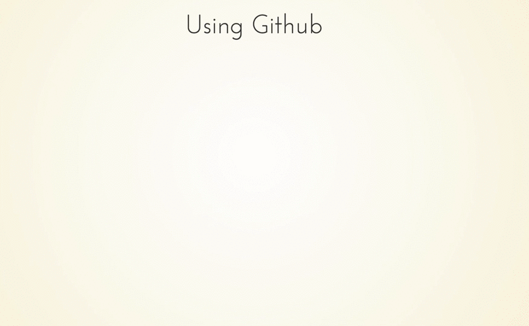

# Module 4: Introduction to Git and GitHub

## Overview
Being able to manage changes to your code and share it with others is one of the most important technical skills a programmer can learn. Unfortunately, a frightening number of people still email their code, have dozens of versions of the same file, and lack a system for backing up their code. This is both time consuming and error prone.

Luckily, there are wonderful tools for tracking changes to your code (git), and for facilitating collaboration (GitHub). Git and GitHub are the industry standards for these family of tasks which we'll refer to as **version control**.

<!-- START doctoc generated TOC please keep comment here to allow auto update -->
<!-- DON'T EDIT THIS SECTION, INSTEAD RE-RUN doctoc TO UPDATE -->
**Contents**

- [Resources](#resources)
- [Git](#git)
- [GitHub](#github)
  - [Configuration](#configuration)
  - [Workflow Example](#workflow-example)
  - [Course Assignments on GitHub](#course-assignments-on-github)

<!-- END doctoc generated TOC please keep comment here to allow auto update -->

## Resources
- [Try Git](https://try.github.io/levels/1/challenges/1): An interactive tutorial for learning `git`
- [Git Documentation](https://git-scm.com/documentation)
- [Setting up git](https://help.github.com/articles/set-up-git/) (with GitHub)
- [Git command line reference](https://git-scm.com/docs)
- [Git Introductory Videos](http://git-scm.com/videos)
- [Git cheatsheet](https://training.github.com/kit/downloads/github-git-cheat-sheet.pdf)
- [Hosting with GitHub Pages](https://help.github.com/articles/creating-project-pages-manually/)

## Git
`Git` is a free and open-source version control software that provides you with a set of command line tools for tracking changes to your files.  

All of the files in a project directory (referred to as a `repository`, or `repo`) are tracked by a hidden `.git` file in the root of the project.  You can initiate a repository with the `git init` command.  

Git allows you to roll back to a previous snapshot of your project called a `commit`.  When you want to take a snapshot of your work, you'll need to `add` your the changes to your files to a **staging area**.  You can think of a staging area (literally) like a staging area.  The changes that you want to be included in your next snapshot need to be put on stage in order to be captured by the `commit`.  Each time you take a snapshot (`commit`), you'll need to include a short message that describes the set of changes.  These steps fit together as follows:


Here is additional information on each (of these) `git` commands (note, this **_is not_** a full list -- see [documentation](https://git-scm.com/docs)):

| Command  | Function |
| ------------- | ------------- |
| `git init` | Initialize a new repository in the current directory. This creates a database to track file changes, which you **only do once** at the start of a project. |
| `git status`  | Reports any changes to the files in your repo. |
| `git add FILE-NAME` or `git add .`  | Adds a file or files (`.`) to the staging area. All changes to those files will be included in the next commit. |
| `git commit -m "Description"`  | Commits all changes to all files currently in the **staging area** to the repository. This takes a snapshot that you can return to and **must include a message** with `-m`.|

So far, the process described all occurs on your local machine. This is a good practice, but does not facilitate collaboration with others, or create a backup of your code. For these purposes, we'll use **GitHub**.


## GitHub
In order to share our code and collaborate with others, we'll need a publicly accessible (cloud) location where we can store our files (and file _history_) -- that's what GitHub is for.

GitHub is the most popular open-source web-based repository hosting service.  In addition to providing a great UI on top of a server that hosts your repositories, GitHub has a number of additional features such as issue tracking, wiki pages, and notifications that make it a great collaboration tool.  

The important thing to keep in mind is that GitHub doesn't just store the a copy of your code files in your repository -- it stores the **entire database of changes** to the files. This allows other developers to view the files at an earlier point in time.  

### Configuration
Before we can begin using git and GitHub together, we'll need to use our terminal to configure the GitHub user. This tells your machine which GitHub user you are, granting you permission to your own repositories. You'll only need to **do this once** on your own machine, though if you are using another computer (lab machine), you'll need to remember to do it.

Once you open your terminal, you'll need to specify your name and GitHub username:

```bash
# Enter YOUR NAME to set your name
git config --global user.name "YOUR NAME"

# Enter YOUR EMAIL to set your email. Make sure it is the email associated with your GitHub account!
git config --global user.email "YOUR EMAIL"
```
See [this article](https://help.github.com/articles/set-up-git/) for more information on setting up GitHub.

### Workflow Example
Here is _one_ example of a workflow you may choose when working with a project. Let's imagine that there's a repository online that you want to use as a starting point for a project (**this is how we will do class/lab exercises**). First, you may want **your own cloud copy** of a repository on GitHub.  To create your own copy, you'll simply click the **fork** button in a GitHub repository:



That will create a copy of the **entire repo** on your GitHub account. In order to start working on the files, you'll need to get them on your computer (they're still only in the cloud). To do so, you will clone **your forked repository** (_not_ the original one) to your machine. This will create a local copy of the files **as well as their entire history** on your local machine. We'll use the terminal to clone the repository, but we need to get some information about it first. To get the URL location of the repository, click the **Clone or Download** button, then click on the clipboard icon to copy the URL to your clipboard:



Then, on your terminal, you could use the `git clone` command described below.  Here is a diagram of the full process:




Here are additional `git` commands that allow you to interact easily with GitHub:

| Command  | Function |
| ------------- | ------------- |
| `git clone REPO-URL` | Creates a new copy of a source repository, which typically exists on a remote server. Use this when you want to clone down a GitHub repository. This command will create a new subdirectory with the same name as the source repository. |
| `git push origin master`  | Pushes all commits on the `master` branch made since the last push to another repository (`origin`), typically across the network (e.g., to GitHub)  |
| `git pull`  | Pulls all commits made since the last pull from another repository, and attempts to merge those changes into your current files. |
| `git config` | Configure your GitHub account. You should run `git config --global user.name "Your Full Name" and `git config --global user.email your-github-email` to initially set up. |

### Course Assignments on GitHub
Assignments in this course are configured using the GitHub Classroom application. Each student should click on the appropriate link in Canvas to create a new private repository on their GitHub account: this should happen automatically. Private repositories are accessible by TAs and instructors. Once the repository is created, you should be able to follow these simple steps from above:

1. **Clone** the repository to your local machine (`git clone REPO-URL`)
2. Make changes to your files
3. **Add** files with changes to the staging area (`git add .`)
4. **Commit** these changes to take a snapshot of this point in time (`git commit -m "Commit Description"`)
5. **Push** changes back to GitHub (`git push origin master`)

Repeat steps 3 - 5 each time you want to make a checkpoint of your work and save that snapshot (commit) locally and in the cloud.

Using git and GitHub can be challenging, and you'll inevitably run into issues. While it's tempting to ignore version control systems, **they will save you time** in the long-run. For now, do your best to follow these processes, and read any error messages carefully. If you run into trouble, try to understand the issue (Google/StackOverflow), and consult other for help.

To practice using these basic commands, see [exercise-1](exercise-1).
